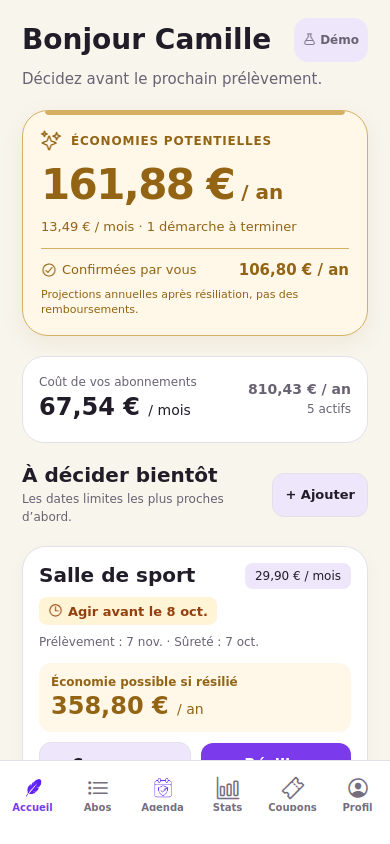
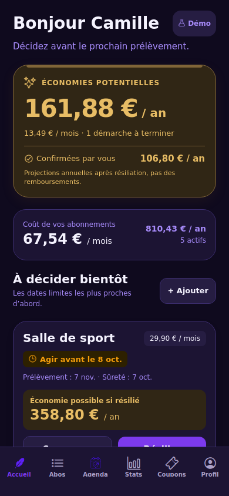
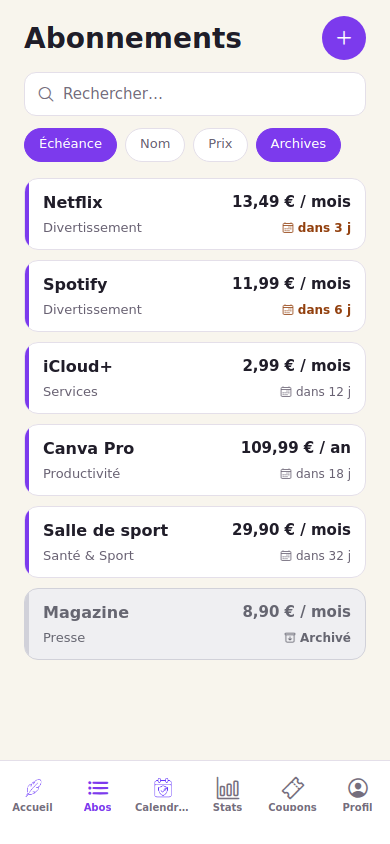
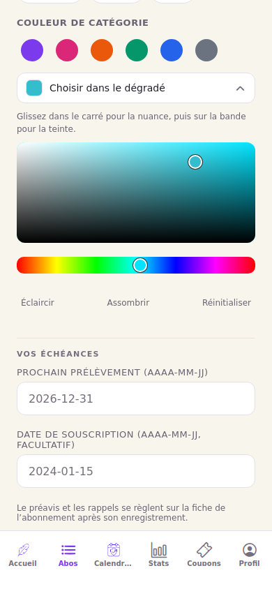
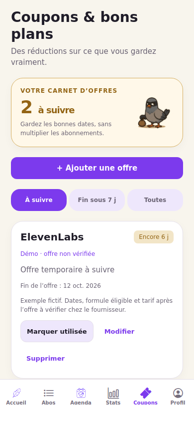
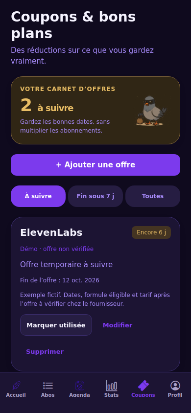
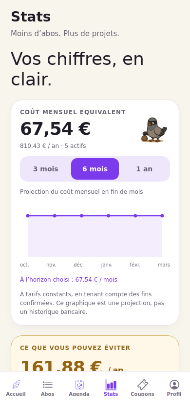
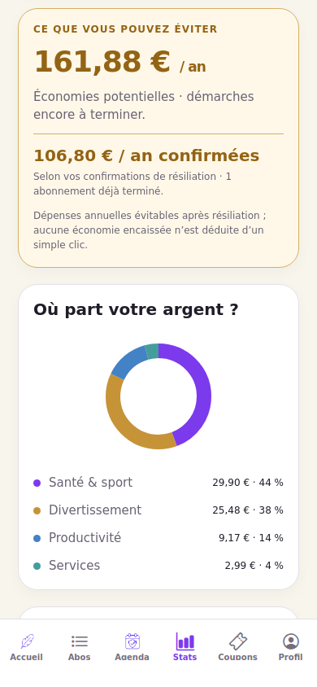

# PigeonSub — accueil économies, couleurs et archives

> Livraison suivante : [dates de sûreté gratuites, galerie photo et nouveau build](SURETE-PHOTOS-20261006.md). Ce nouveau guide précise les règles actuelles et remplace les anciens accès exclusivement Plus aux dates et photos.

## État de GitHub

La PR #2 (onboarding, démo, Plus, thèmes et SDK 57) a été fusionnée dans `main` le 6 octobre 2026 : commit de fusion `f59cfb542fadd5b8fb74cc854ac18b0ea16451e2`.

Le main précédent reste sauvegardé dans `backup/main-before-sdk57-20261006-e94acca` au commit `e94accafa3ec11aaf93baa1428cc1ce4554d2e8c`. Les sauvegardes antérieures sont conservées.

Les nouvelles retouches sont isolées dans `feat/savings-home-polish`, créée depuis ce main fusionné. Elles ne sont pas encore fusionnées dans main. Aucun nouveau build TestFlight n'a été lancé.

## Ce qui change dans cette branche

- **Accueil** : les économies potentielles passent en premier dans une carte dorée avec montant annuel en grand, équivalent mensuel et nombre de démarches à terminer. Les économies confirmées par l'utilisateur restent identifiées séparément. Les coûts mensuel/annuel sont affichés juste dessous.
- **Échéances** : les cartes restent triées par date limite d'action, en tenant compte du préavis. La limite est mise en évidence ; l'économie possible d'une résiliation a son propre encadré. Les achats uniques ne sont plus proposés dans les décisions de renouvellement.
- **Démo** : petit badge en haut, ouvrant le profil pour gérer/quitter la démo, à la place du grand bandeau. Les exemples restent explicitement fictifs.
- **Couleur d'abonnement** : six couleurs prédéfinies et un dégradé interactif de teinte/nuance. Aucun code hexadécimal à saisir. La représentation interne reste compatible avec les abonnements existants. Même sélecteur dans l'ajout et la modification.
- **Apparence** : seulement Clair et Sombre. Le choix est conservé. Une ancienne préférence Système est convertie une fois en la couleur alors utilisée par l'appareil ; elle ne suit plus ensuite les changements du système. Une nouvelle installation commence en clair.
- **Archives** : fond, texte et barre latérale gris, libellé Archivé, aucune fausse échéance urgente. La fiche reste ouvrable. L'état archivé tient aussi compte d'une résiliation dont la date de fin est atteinte. Le bouton Archives continue d'inclure les archives dans la liste des abonnements actifs.

Les formules d'économies ne changent pas : une demande de résiliation reste potentielle ; la confirmation et sa date d'effet restent nécessaires. Les montants annualisés ne sont ni un remboursement ni une mesure vérifiée auprès d'une banque.

Le thème clair utilise désormais un fond crème, des cartes blanches et des accents violets. Les économies et le bandeau Plus ont un encadrement doré.

- **Coupons** devient un onglet visible : ajout/modification d’une offre, service, description, code copiable, lien HTTPS, date de fin et conditions. Filtres À suivre / Fin sous 7 j / Toutes, statut utilisée réversible, suppression confirmée. Fonctionne sans compte et en démo. Données persistées sur l’appareil, isolées par compte ; elles ne sont pas synchronisées avec le backend et n’envoient pas de notifications automatiques. Les exemples (dont ElevenLabs) sont fictifs et explicitement non vérifiés. Aucun catalogue de promotions réelles n’est annoncé.
- **Stats** remplace Bilan : répartition des coûts par catégorie, abonnements peu utilisés, économies potentielles/confirmées, projection du coût mensuel équivalent à la fin de chacun des 3/6/12 prochains mois. Les fins confirmées sont prises en compte ; les simples intentions de résilier ne réduisent pas les coûts. Aucun historique bancaire fictif n’est créé. Le calendrier est accessible sous **Agenda** pour que les six onglets restent lisibles.
- **Dépendances** : `shell-quote` transitif (React Native → react-devtools-core) est verrouillé en **1.11.0**, corrigé pour [CVE-2026-102422 / GHSA-pqg4-j6r4-53mv](https://github.com/ljharb/shell-quote/security/advisories/GHSA-pqg4-j6r4-53mv). Replit bloquait le tarball 1.10.0 ; son journal ne donne pas le numéro de CVE, mais cette version est affectée par cet avis. Aucun filtre de sécurité n’a été désactivé. Le lock conserve les URLs publiques npm avec intégrité.
- `expo-clipboard@57.0.2`, choisi par `expo install` pour SDK 57, permet la copie des codes sur mobile/web. Les contrôles de dates et liens refusent les dates impossibles et les liens exécutables.

Expo reste verrouillé à **57.0.26**. `app.json`, les identifiants Apple/Expo, le backend et `.replit` ne changent pas. Les mises à jour de patches Expo simplement annoncées par la CLI ne sont pas incluses dans cette correction ciblée.

La branche avant ces modifications est sauvegardée sur GitHub : `backup/savings-ui-20261006-a2ffd0e` → `a2ffd0e7eb3b6418b6707de9aab0f1408afc927c`.

## Récupérer main dans Replit

À la racine du projet mobile, cliquer Stop puis :

```sh
git status
```

Si l'arbre de travail est propre :

```sh
git fetch origin
git switch main
git pull --ff-only origin main
npm ci && npm run mobile:check
```

Le main distant est déjà fusionné : il n'y a pas à refaire `git merge feat/onboarding-safety-paywall`. Run relance ensuite cette version main dans Replit. Un changement de branche ne déclenche pas à lui seul une publication TestFlight.

Si des fichiers modifiés ou non suivis apparaissent, les conserver avant de changer de branche :

```sh
git stash push -u -m "replit-before-main-sdk57-polish"
git stash list
```

Ce stash reste local et n'inclut pas les fichiers ignorés, notamment les secrets `.env`. Ne pas réappliquer d'anciens paramètres de publication ou un lockfile complet sans les comparer. Si Git signale une divergence, conserver le message et les commits locaux ; ne pas utiliser `reset --hard` ou `push --force`.

## Tester les nouvelles retouches dans Replit

Après la récupération de main, arrêter le workflow, vérifier que le travail local est conservé et passer sur la nouvelle branche :

```sh
git fetch origin
git switch feat/savings-home-polish
git pull --ff-only origin feat/savings-home-polish
npm ci && npm run mobile:check
```

Puis Run et ouvrir le nouveau QR/lien dans Expo Go SDK 57. Le lockfile de cette branche corrige la version bloquée et ajoute le presse-papiers compatible. Attendre la réussite de `npm ci` avant le contrôle mobile. Si une erreur 403 persiste, conserver le nom et la version indiqués et arrêter là ; ne pas modifier le registre pour passer outre le filtre. Le preview web reste disponible avec `npm run preview:web` sur le port 8083 déjà déclaré dans Replit.

Pour revenir au main intégré : Stop, vérifier/conserver les changements locaux, `git switch main`, puis Run. Après validation des retouches, fusionner leur PR vers main et refaire `git pull --ff-only origin main` dans Replit avant la publication habituelle.

## Vérifications réalisées

- `npm ci` réussi et contrôle `mobile:check` : SDK 57.0.26, lockfile public cohérent.
- TypeScript sans erreur et **32 tests réussis** : logique existante, couleurs/thèmes, sécurité de shell-quote, dates/liens des offres, persistance/isolation/suppression et projections avec fins confirmées.
- Export iOS de production réussi.
- Navigateur au format téléphone : économies en haut de l'écran, badge démo compact, deux thèmes persistants, archives grises/ouvrables, sélection et glissement dans le dégradé, ajout puis rechargement/modification, distinction économie potentielle/confirmée après clic Résilier. Aucune erreur JavaScript non interceptée lors de ces parcours.
- Coupons vérifiés dans le navigateur : création, date/lien invalide, copie réelle du code, modification, rechargement, filtre à 7 jours, statut utilisée, suppression avec confirmation, passage démo/perso sans mélange. Stats : sélection des périodes, graphique, catégories et lien vers les abonnements. Formats 390 px et 320 px, clair/sombre.
- Captures inspectées en clair et sombre.

Ces vérifications locales ne sont pas une compilation Xcode signée ni un test du toucher sur iPhone ou du simulateur distant de Replit. À confirmer sur ces appareils avant de republier. Les prérequis Apple/RevenueCat et notifications restent ceux du guide initial.

## Captures web au format téléphone
















