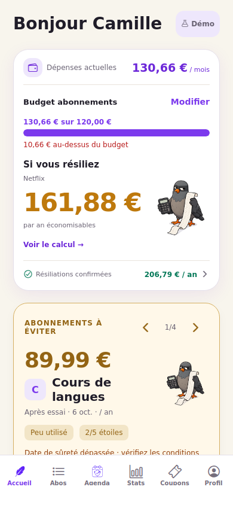

# Preview Replit — 7 octobre 2026

## Constat

Les captures de 06:00 montrent Expo démarré sur 8081 et le backend prêt sur 8082. Le simulateur iPhone intégré reste blanc. Aucune erreur JavaScript de l’application ni compilation iOS n’apparaît dans l’extrait fourni : il ne permet pas de déterminer la cause du blocage de ce simulateur.

L’erreur `react-native-devtools: error while loading shared libraries: libglib-2…` concerne le débogueur desktop. Le bundler continue après cette erreur. Le workflow ne lançait pas le serveur web 8083 pourtant déclaré dans les ports : il fallait le démarrer manuellement.

## Correction

- **Run → Project** démarre trois workflows : Start Expo, Start Backend, **Start Web Preview**.
- `preview:web` lance l’Expo local verrouillé, en web sur **8083**, exposé sur **3001**. Le lien public est affiché dans la console si `REPLIT_DEV_DOMAIN` est présent.
- `preview:native` conserve le serveur **8081** et l’adresse `REPLIT_EXPO_DEV_DOMAIN` destinée à Expo Go.
- La preview web remplace un éventuel proxy natif hérité du Shell par sa propre adresse publique ; hors Replit, elle utilise son adresse locale.
- Le mode headless disponible dans le CLI Expo installé évite l’installation du débogueur desktop. Les contrôles de dépendances, d’architecture et de prérequis web restent explicitement activés. Ce réglage interne au CLI SDK 57 devra être revérifié lors d’une future migration du SDK.
- L’URL API existante est respectée. Si elle est absente du processus, le domaine de développement Replit fournit le backend sur `:3000/api`.
- Les caches sont conservés au lancement normal. `npm run preview:web -- --clear` reste disponible en cas de cache obsolète.

Les identifiants iOS/Android, dépendances, données et paramètres de publication backend restent inchangés. Cette correction configure les serveurs de développement ; elle ne met pas à jour le runtime du simulateur distant.

## Ouvrir la preview

1. Cliquer **Stop** dans Replit avant la récupération.
2. À la racine du projet, conserver d’éventuelles modifications locales puis récupérer `main` :

```sh
git stash push -u -m "avant-correctif-preview"
git fetch origin
git switch main
git pull --ff-only origin main
npm ci
```

3. Cliquer **Run**. La console doit afficher **Start Web Preview** et l’ouverture du port **8083**.
4. Ouvrir le lien affiché par ce workflow, avec le port externe **3001**, dans un nouvel onglet de navigateur. On peut aussi sélectionner 8083 dans les outils Preview/Ports. Le cadre du simulateur iPhone est un autre aperçu.
5. Si Replit conserve les anciens workflows après la récupération, rafraîchir l’éditeur. En attendant, lancer `npm run preview:web` dans un Shell séparé, uniquement si aucun serveur n’écoute déjà sur 8083.

Le premier chargement compile le bundle web ; attendre le message `Web Bundled`. Le mode démo et l’espace sans compte fonctionnent sans backend. Les écrans connectés nécessitent son URL correcte et le workflow backend en marche.

Pour le simulateur natif : Stop/Run, rouvrir la preview, puis recharger le client avec le nouveau lien Expo. Si l’écran reste blanc, récupérer les nouveaux logs **après** avoir tenté de l’ouvrir ; il faut alors distinguer l’absence de connexion, une incompatibilité du runtime et une erreur native. Ne pas supprimer les données personnelles pour ce diagnostic.

## Vérification effectuée

- Configuration Replit analysée avec `tomllib` : trois workflows rattachés à Run et ports 8081/8082/8083 conservés.
- TypeScript et syntaxe du script de lancement : réussis.
- Les deux commandes de lancement fonctionnent simultanément. Les deux endpoints `/status` répondent ; le manifeste iOS annonce SDK 57.0.0 et conserve le proxy natif.
- Test réel Chromium, format 390 × 844, sur le nouveau serveur web avec un proxy natif volontairement hérité : introduction, entrée sans compte, démo remplie, accueil, Stats, feuille de route et rechargement réussis. Aucune erreur JavaScript ni requête échouée.
- Aucune tentative d’installation du débogueur desktop dans les logs de ces lancements.

Le test est local, pas dans la session Replit de Laure. Le simulateur iPhone distant, l’exposition effective des ports de cette session et les achats/notifications natifs n’ont pas été vérifiés. Aucun nouveau build TestFlight ou déploiement backend n’est requis pour cette seule correction de preview.



## Références

- [Preview Replit](https://docs.replit.com/features/editor/preview)
- [Ports Replit](https://docs.replit.com/features/project-setup/ports)
- [Dépannage mobile Replit](https://docs.replit.com/features/troubleshooting/mobile-app)
- [Expo CLI : serveur et URL du proxy](https://docs.expo.dev/more/expo-cli/)
