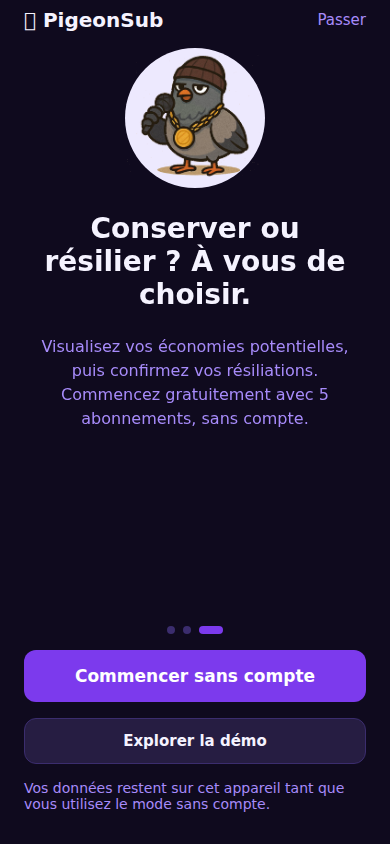
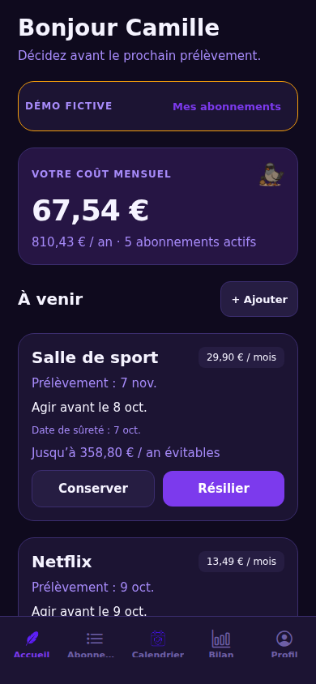

# PigeonSub — livraison onboarding, date de sûreté et Plus

## Référence et stratégie Git

- Main de départ : `e94accafa3ec11aaf93baa1428cc1ce4554d2e8c`.
- Sauvegarde GitHub du même commit : `backup/testflight-main-20261006-e94acca`.
- Nouveautés : `feat/onboarding-safety-paywall`.
- Le main n’est pas modifié par cette livraison. La branche permet une revue et un essai avant fusion. Ne pas réappliquer les anciennes commandes de migration Expo ou de remplacement du lockfile.
- Expo reste en **SDK 54.0.37** ; les URL npm du lockfile restent publiques. Ni les workflows Replit, ni le backend, ni les identifiants d’application ne sont modifiés. `app.json` ajoute le plugin de notifications locales.

## Parcours livrés

- Onboarding français, animation de plume existante conservée, démarrage sans inscription.
- Deux entrées en fin d’onboarding : commencer sans compte ou explorer une démo.
- Données invité persistantes sur l’appareil. Démo isolée, préremplie avec six exemples et des dates relatives au jour du test ; réinitialisée à chaque nouvelle entrée volontaire. Aucun appel au compte démo partagé du backend, achat ou notification réelle en démo.
- Accueil : coût mensuel équivalent et annuel, échéances triées par date limite pour agir (le préavis peut rendre urgent un prélèvement plus lointain), préavis/date limite/date de sûreté, Conserver/Résilier. Les bilans détaillés viennent ensuite.
- Résilier ouvre une démarche à réaliser auprès du fournisseur. La confirmation exige une date de fin et une déclaration explicite. Une intention ne réduit pas les coûts. Une fin future reste dans les coûts jusqu’à sa date. Les économies sont des projections annualisées distinctes, jamais des remboursements ou un solde bancaire.
- Calendrier et bilan utilisent les mêmes calculs, y compris mensualisation des paiements annuels, semaines et achats à vie exclus des coûts récurrents.
- Gratuit : cinq abonnements actifs, totaux, calendrier et un rappel standard par échéance. Au sixième abonnement (ou à une réactivation au-delà de cinq), le paywall s’affiche sans supprimer ni masquer les abonnements existants.
- Plus : illimité, avance personnalisable du rappel, ajout de justificatifs, historique des décisions. Les justificatifs existants restent lisibles et supprimables après expiration.
- Paywall contextuel et refermable : jamais imposé dans l’onboarding. Les tarifs prévus sont 2,99 €/mois, 19,99 €/an (mis en avant), 34,99 € une fois pour l’offre Fondateur. Les prix réellement proposés proviennent de la boutique.

## Récupérer dans Replit sans perdre de travail

Dans le dossier racine du projet mobile, commencer par :

```sh
git status
```

Si des modifications locales apparaissent, les conserver avant de changer de branche :

```sh
git stash push -u -m "replit-before-onboarding-20261006"
git stash list
```

Le stash reste **local** et n’est pas envoyé sur GitHub. `-u` conserve les fichiers non suivis, mais pas ceux ignorés par Git (par exemple les fichiers `.env`). Les secrets et réglages du service Replit restent à conserver dans Replit. Ne pas réappliquer un ancien stash entier sur la nouvelle branche : comparer d’abord ses changements, en particulier les champs que la publication Replit injecte dans `app.json`.

Puis, une commande à la fois :

```sh
git fetch origin
git switch feat/onboarding-safety-paywall
npm ci
npm run mobile:check
npx tsc --noEmit
npm test
```

`git switch` crée normalement le suivi de la branche distante si elle n’existe pas déjà localement. Si Git refuse à cause de fichiers locaux ou d’une divergence, conserver ce message et résoudre ce cas avant de poursuivre, sans `reset --hard` ni `push --force`.

Le nouveau module natif de rappels et RevenueCat nécessitent **un nouveau build iOS**. Une ancienne app Expo Go ou un ancien build TestFlight ne suffit pas à valider ces ajouts. L’aperçu web peut vérifier les écrans, mais pas les achats Apple ni la réception des notifications natives.

## Achats : configuration à terminer avant activation

La navigation paywall et les appels d’achat/restauration sont réels. Sans configuration, ils restent désactivés ; le gratuit et la démo fonctionnent.

1. Utiliser **l’application App Store Connect du build qui fonctionne**. Conserver ses identifiants de bundle, son équipe Apple et le projet Expo/Replit existant. La source Git ne remplace pas les paramètres que Replit injecte lors de sa publication.
2. Dans App Store Connect, préparer les produits Plus mensuel et annuel dans le même groupe d’abonnements, et le produit non consommable Fondateur. Configurer les tarifs et les disponibilités réelles. Si l’essai est retenu, configurer une offre introductive gratuite de sept jours pour les abonnements concernés.
3. Dans RevenueCat, connecter cette application Apple, importer les produits, et leur associer l’entitlement exact **`plus`**. Créer une offering courante avec les packages **Monthly, Annual, Lifetime**. Retirer Lifetime de cette offering à la fin de l’offre Fondateur, sans révoquer les droits des acheteurs existants. Les fonctionnalités IA futures ne sont pas annoncées comme déjà disponibles.
4. Dans les variables du build Replit, renseigner la **clé SDK publique iOS** `EXPO_PUBLIC_REVENUECAT_IOS_KEY`. Pour Android seulement, la clé SDK publique Android est `EXPO_PUBLIC_REVENUECAT_ANDROID_KEY`. Ne jamais mettre une clé privée Apple ou RevenueCat dans une variable `EXPO_PUBLIC_*`.
5. Publier la politique de confidentialité complète de l’application et renseigner son URL HTTPS dans `EXPO_PUBLIC_PRIVACY_POLICY_URL`, ainsi que dans App Store Connect. L’écran informatif embarqué ne remplace pas les mentions de l’éditeur et la politique publique exigées pour la distribution.
6. Tester l’achat, l’annulation de la feuille Apple, la restauration et l’expiration avec les outils sandbox/TestFlight. L’essai « 7 jours gratuits » ne s’affiche que si la boutique fournit effectivement cette offre et confirme l’éligibilité du compte. Il n’est pas activé par un simple clic local ni par un faux drapeau Premium.

Les achats sont liés à l’identité RevenueCat : identité anonyme persistée sans compte, puis identifiant `pigeonsub_user_<id>` pour un compte connecté. Vérifier dans RevenueCat la politique de transfert/restauration attendue pour votre application, notamment le passage d’un invité à un compte existant. Ne pas utiliser le compte démo pour les achats.

## Rappels et données : limites explicites de cette version

- Demande de permission uniquement quand l’utilisateur active son premier rappel. Pas de permission de notification imposée dans l’onboarding.
- Rappels **locaux** à 9 h, recalculés à l’ouverture/retour au premier plan, après modification et après changement d’offre. Au plus les 60 prochains rappels, pour rester sous la limite iOS, avec jusqu’à 12 échéances calculées par abonnement. Rouvrir régulièrement l’app renouvelle cette programmation ; aucun service push serveur n’est prétendu.
- Gratuit : veille de la limite estimée à partir du préavis renseigné. Plus : marge choisie avant cette limite. Les dates déjà passées ne produisent pas de notification antidatée. L’utilisateur doit vérifier les conditions du fournisseur.
- La démo n’envoie aucune notification. Un changement de session retire les rappels de la session précédente. Les rappels d’un abonnement résilié sont arrêtés à sa date de fin confirmée.
- Invité et démo sont stockés séparément via AsyncStorage. Les comptes existants conservent leur API et leur stockage serveur. **Les décisions, preuves de décision textuelles et réglages de rappel sont locaux, même pour un compte connecté** ; leur synchronisation multi-appareils n’est pas implémentée.
- Une inscription/connexion ne transfère pas automatiquement les abonnements de l’invité. Ils sont conservés et retrouvés en revenant au mode sans compte. La désinstallation peut effacer les données locales ; cette version ne prétend pas les sauvegarder dans le cloud.
- Les limites et fonctions Plus sont contrôlées dans le client et vérifiées via le SDK RevenueCat pour l’accès payant. Il n’y a pas de nouveau contrôle d’entitlement ou quota dans l’API backend existante. Une future API Premium ou IA payante devra vérifier les droits côté serveur.

## Vérifications avant fusion et nouveau TestFlight

Vérifications locales : TypeScript sans erreur, 25 tests réussis (calculs, dates, quota, isolation du stockage, essai, URL et SDK), export iOS de production et prebuild iOS sans installation des pods dans une copie isolée. Le parcours a aussi été exercé dans un navigateur au format téléphone : onboarding → démo → confirmation de résiliation → invité → cinq ajouts avec prix à virgule → rechargement → paywall au sixième → retour gratuit. Ces essais d’interface ne remplacent pas les tests des services natifs sur iPhone. Le prebuild conserve l’avertissement déjà présent sur l’absence d’icône explicite dans la source Git ; réutiliser la configuration d’icône du flux Replit qui a produit le build accepté.

À valider sur le nouvel iPhone/TestFlight :

1. Première ouverture : plume qui zoome, trois étapes en français, aucune inscription obligatoire.
2. Démo : données prêtes, dates proches, actions, aucune demande Apple/notification réelle. Quitter la démo retrouve les données invité.
3. Invité : ajouter/modifier un abonnement, fermer et rouvrir l’app. Les données restent présentes. Tester cinq abonnements puis le sixième et le retour gratuit du paywall.
4. Résiliation : intention seule = coût inchangé ; confirmation à effet futur = coût maintenu jusqu’à la date ; retour à Conserver = économie retirée. Aucun message ne promet une résiliation automatique.
5. Rappels : permission acceptée et refusée, marge standard/personnalisée, date avec préavis, notification réelle en arrière-plan, ouverture de la bonne fiche. Tester aussi le changement de fuseau horaire et la reprogrammation après retour dans l’app.
6. Comptes existants : connexion, données serveur, déconnexion/reconnexion. Aucune démo partagée ni mélange entre utilisateurs.
7. Achats : vérifier les prix Store, l’éligibilité des sept jours, restauration et expiration, puis les déclarations de confidentialité App Store.

Après revue et validation, fusionner la PR vers `main`, puis dans Replit :

```sh
git status
git fetch origin
git switch main
git pull --ff-only origin main
npm ci
npm run mobile:check
```

Vérifier un état Git propre et noter `git rev-parse --short HEAD`. Réutiliser ensuite **le même flux de publication Replit vers TestFlight qui a fonctionné**, avec un numéro de build supérieur au précédent et les mêmes identifiants. La branche/source réellement utilisée par la publication doit être le main mis à jour ; un build lancé depuis une autre branche ou une archive déjà créée ne bascule pas automatiquement sur main.

Cette livraison ne lance ni fusion sur main ni publication cloud. L’export JavaScript et le prebuild Linux ne constituent pas une compilation/signature Xcode ni une validation Apple des achats.

## Aperçus des écrans

Captures de l’aperçu web en format téléphone, avec données fictives :




