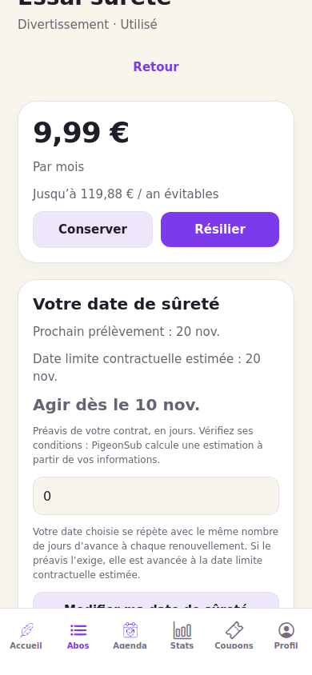
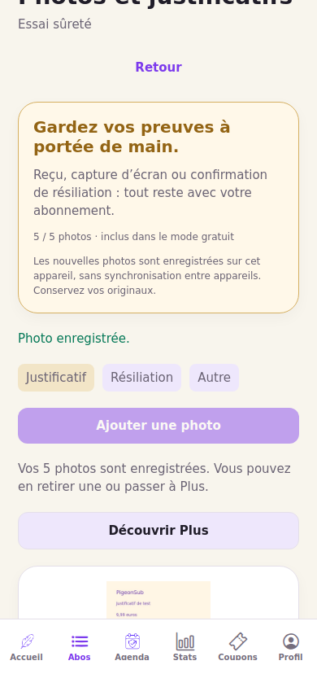
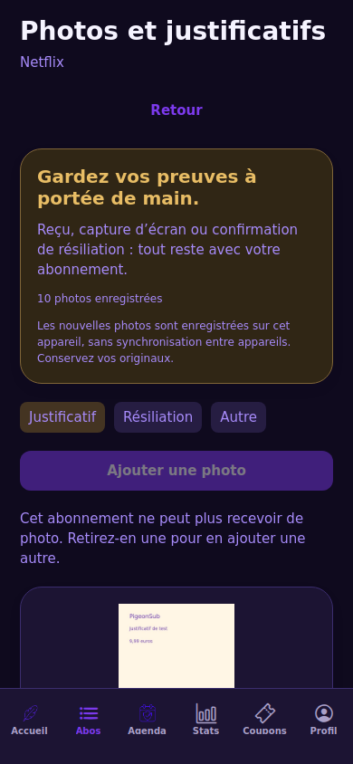

# PigeonSub — dates de sûreté et photos, 6 octobre 2026

Cette livraison complète la PR #3 avec les règles demandées pour le gratuit et Plus. Les retouches accueil doré, Coupons, Stats, thème crème/violet, dégradé de couleurs et archives restent incluses.

## Règles livrées

| Fonction | Gratuit | Plus |
| --- | --- | --- |
| Abonnements actifs | 5 | Illimités |
| Date de sûreté personnalisée | Sur les 5 abonnements | Sur tous les abonnements |
| Photos par abonnement | 5 | 10, limite technique non affichée dans l’offre commerciale |

Une date se choisit dans l’ajout ou la modification d’abonnement, avant le prélèvement/la fin de l’essai. La même avance en jours est conservée pour les renouvellements suivants. Un préavis peut avancer la date de sûreté à la limite contractuelle estimée. La fiche permet aussi de choisir une avance relative et d’activer un rappel local à 9 h. Les rappels passés ne sont pas envoyés rétroactivement.

Après expiration de Plus, les cinq abonnements actifs les plus anciens (identifiant en départage) conservent l’ajout de photos et les rappels personnalisés. Les autres abonnements, dates et photos restent consultables. Aucune photo excédentaire n’est supprimée ; l’ajout est bloqué tant que le quota est atteint. Archiver un abonnement libère un emplacement gratuit. Les archives restent lisibles.

## Photos et conservation

La fiche ouvre « Photos et justificatifs » : photothèque, caméra sur téléphone, agrandissement, retrait confirmé et notes. Les anciennes preuves d’achat/résiliation restent accessibles et comptent dans le quota. Les fichiers choisis sont redimensionnés et encodés en JPEG avant enregistrement ; aucune URI temporaire du sélecteur ne sert de stockage durable.

**Les nouvelles photos sont enregistrées sur l’appareil, sans synchronisation serveur.** L’écran le précise. Chaque photo est un enregistrement séparé, avec un index léger, pour éviter de grossir tout le fichier de données et les limites par ligne d’AsyncStorage sur Android. Les comptes, l’invité et la démo sont isolés. Suppression d’un abonnement/compte et réinitialisation de la démo nettoient leurs photos locales. Désinstaller l’app ou effacer le stockage du navigateur peut les supprimer : conserver les originaux. Aucun déploiement de base de données n’est requis.

## Sauvegardes GitHub

- `backup/safety-photos-20261006-1e40483` : branche de fonctionnalités avant ces ajouts.
- `backup/main-before-safety-photos-20261006-f59cfb5` : main avant la fusion de la PR #3.
- Les sauvegardes SDK54/TestFlight antérieures restent présentes.

## Validation effectuée

- 38 tests : quotas gratuit/Plus, ajout concurrent, conservation après expiration, anciens justificatifs, dates et renouvellements, isolation, suppression et échec d’écriture sans perte.
- TypeScript et contrôle mobile sans erreur.
- Preview web réellement parcourue en 390 px et 320 px : date invalide refusée, date choisie enregistrée, vrai sélecteur de fichier, compression JPEG, ajout jusqu’à 5 puis 10, plafond, retrait/annulation/réajout, agrandissement, note conservée, rechargement, thèmes clair/sombre et séparation invité/démo.
- Export iOS de production réussi (1492 modules, bundle Hermes).
- Prebuild iOS sans installation des pods réussi dans une copie isolée.
- Module ajouté : `expo-image-manipulator`, plage SDK57 `~57.0.20`, version verrouillée `57.0.21`. Expo reste à 57.0.26 et shell-quote à 1.11.0. Lockfile en URLs npm publiques avec intégrités.
- Les messages de permissions photo/caméra sont français. Identifiants Apple/Expo, backend et configuration Replit inchangés.

## Lancer le nouveau build depuis Replit

La CLI de cet environnement répond `Not logged in` à `expo whoami` : **aucun build signé ni envoi TestFlight n’a été lancé ici**. L’export JavaScript et le prebuild ne produisent pas une IPA signée.

Récupérer le main après fusion de la PR #3, depuis la racine mobile :

```sh
git status
```

Si des fichiers ont été modifiés dans Replit, les sauvegarder avant de changer de branche. Le stash est local et ne comprend pas les secrets ignorés par Git :

```sh
git stash push -u -m "replit-before-safety-photos-20261006"
git stash list
```

Puis, une commande à la fois, en s’arrêtant si l’une échoue :

```sh
git fetch origin
git switch main
git pull --ff-only origin main
npm ci
npm run mobile:check
git status
git log -1 --oneline
```

Le main Git ne contient pas les identifiants du projet Expo géré par Replit. Réutiliser le flux Replit de publication mobile qui a réussi, **le même owner/projet Expo Replit et la même application App Store Connect**. Ne pas créer un nouveau projet EAS ni transférer l’owner sur githublaure pour ce build. Si Replit conserve des modifications locales d’app.json pour la publication, comparer uniquement ces paramètres à la version sauvegardée avant de lancer ; ne pas réappliquer un ancien stash entier sur les nouveaux fichiers.

Sélectionner la source main actualisée et un numéro de build iOS supérieur au dernier envoyé, puis lancer la publication mobile/TestFlight depuis Replit. Une ancienne archive ou une autre branche ne prend pas automatiquement le nouveau main.

Sur iPhone, vérifier la caméra, la photothèque refusée/autorisée, les justificatifs après fermeture/réouverture, les achats/restaurations déjà configurés et une notification réelle. Ces points natifs ne peuvent pas être validés uniquement dans la preview web.

## Aperçus






